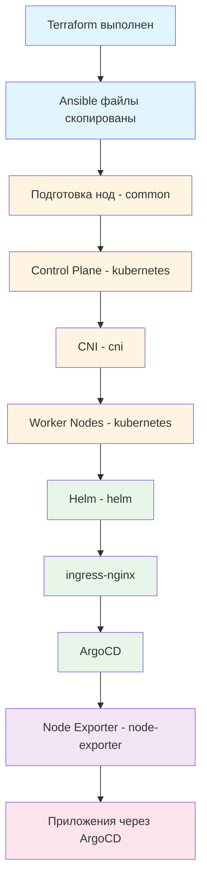

# Ansible

Эта директория содержит Ansible playbooks и roles для автоматического развертывания Kubernetes кластера на **Ubuntu** нодах и инфраструктурных приложений.

<details>
<summary><strong>📋Описание</strong></summary>

---

Этот проект использует Ansible для автоматизации развертывания:

- **Kubernetes кластер** - установка и настройка control plane и worker nodes
- **CNI** - установка сетевого плагина (Flannel)
- **Helm** - пакетный менеджер для Kubernetes
- **ingress-nginx** - Ingress контроллер для маршрутизации трафика
- **ArgoCD** - GitOps инструмент для непрерывной доставки приложений
- **Node Exporter** - сбор метрик с Proxmox хостов

Все конфигурации управляются через переменные Ansible, что делает процесс развертывания воспроизводимым и масштабируемым.

</details>

<details>
<summary><strong>📋Структура</strong></summary>

---

```
02-ansible/
├── ansible.cfg              # Конфигурация Ansible
|
├── inventory/               # Inventory по окружениям
│   └── prod/
│       ├── hosts.yaml       # Inventory (генерируется Terraform из vm-ubuntu/live)
│       └── group_vars/      # Переменные для групп хостов
│           ├── all.yaml
│           ├── kube_control_plane.yaml
│           └── kube_node.yaml
|
├── playbooks/              # Ansible playbooks (только склеивают roles)
│   ├── site.yml           # Главный playbook
│   ├── k8s/               # Kubernetes кластер
│   │   ├── common.yml     # Базовая настройка нод
│   │   ├── control-plane.yml  # Инициализация control plane
│   │   ├── worker.yml     # Присоединение worker нод
│   │   ├── cni.yml        # Установка CNI
│   │   └── reset.yml      # Сброс кластера
│   ├── helm/              # Helm package manager
│   │   └── helm.yml       # Установка Helm
│   ├── ingress-nginx/     # Ingress контроллер
│   │   ├── ingress-nginx.yml
│   │   └── values.yaml    # Helm values для ingress-nginx
│   ├── argocd/            # GitOps инструмент
│   │   ├── argocd.yml
│   │   ├── argocd-ingress.yml
│   │   └── values.yaml    # Helm values для ArgoCD
│   └── node-exporter/     # Мониторинг Proxmox
│       └── node-exporter.yml
|
└── roles/                  # Ansible roles (вся логика здесь)
    ├── common/             # Базовая настройка серверов
    │   ├── defaults/
    │   ├── handlers/
    │   ├── meta/
    │   └── tasks/
    ├── kubernetes/         # Управление Kubernetes кластером
    │   ├── defaults/
    │   ├── meta/
    │   └── tasks/
    ├── helm/               # Установка и управление Helm
    │   ├── defaults/
    │   ├── meta/
    │   └── tasks/
    ├── cni/                # Установка CNI (Flannel)
    │   ├── defaults/
    │   ├── meta/
    │   └── tasks/
    ├── ingress-nginx/      # Установка ingress-nginx
    │   ├── defaults/
    │   ├── meta/
    │   └── tasks/
    ├── argocd/             # Установка ArgoCD
    │   ├── defaults/
    │   ├── meta/
    │   └── tasks/
    └── node-exporter/      # Установка node_exporter
        ├── defaults/
        ├── handlers/
        ├── meta/
        ├── tasks/
        └── templates/
```

</details>

<details>
<summary><strong>🚀Быстрый старт</strong></summary>

---

### Предварительные требования

1. **Terraform должен быть выполнен:**
   - Виртуальные машины созданы
   - Файлы автоматически скопированы на Ansible Control VM
   - Inventory сгенерирован

2. **Доступ к Ansible Control VM:**
   - SSH ключ: `01-terraform/proxmox/vm-ubuntu/live/keys/id_ed25519` (или путь из `ansible_ssh_key_path` в Terraform)
   - IP адрес: `terraform output ansible_control_ip` (из каталога `01-terraform/proxmox/vm-ubuntu/live`)

### Полная установка (рекомендуется)

**Вариант A — с Ansible Control VM** (после того как Terraform скопировал туда файлы):

```bash
# Подключиться к Ansible Control VM
ssh -i 01-terraform/proxmox/vm-ubuntu/live/keys/id_ed25519 ubuntu@<ANSIBLE_CONTROL_IP>

# Запустить главный playbook (путь на control VM)
cd /etc/ansible/playbooks
ansible-playbook site.yml -i inventory/prod/hosts.yaml
```

**Вариант B — с локальной машины** (если inventory и playbooks есть в репозитории):

```bash
cd 02-ansible
ansible-playbook playbooks/site.yml -i inventory/prod/hosts.yaml
```

Этот playbook выполнит все шаги автоматически:
1. Подготовку всех нод (`common` role)
2. Инициализацию control plane (`kubernetes` role)
3. Установку CNI (`cni` role)
4. Присоединение worker nodes (`kubernetes` role)
5. Установку Helm (`helm` role)
6. Установку ingress-nginx (`ingress-nginx` role)
7. Установку ArgoCD (`argocd` role)
8. Установку node_exporter на Proxmox хосты (`node-exporter` role)

</details>

<details>
<summary><strong>⚙️Использование</strong></summary>

---

### Подключение к Ansible Control VM

После выполнения Terraform файлы автоматически копируются на Ansible Control VM через скрипт `push_ansible_files.sh`.

```bash
ssh -i 01-terraform/proxmox/vm-ubuntu/live/keys/id_ed25519 ubuntu@<ANSIBLE_CONTROL_IP>
```

IP адрес Ansible Control VM:
```bash
cd 01-terraform/proxmox/vm-ubuntu/live
terraform output ansible_control_ip
```

### Пошаговая установка

Если нужно выполнить установку по шагам (путь ниже — на Ansible Control VM; при запуске с локальной машины используйте `cd 02-ansible` и `playbooks/...`):

```bash
cd /etc/ansible/playbooks

# Шаг 1: Подготовка всех нод
ansible-playbook k8s/common.yml -i inventory/prod/hosts.yaml

# Шаг 2: Инициализация control plane
ansible-playbook k8s/control-plane.yml -i inventory/prod/hosts.yaml

# Шаг 3: Установка CNI
ansible-playbook k8s/cni.yml -i inventory/prod/hosts.yaml

# Шаг 4: Присоединение worker nodes
ansible-playbook k8s/worker.yml -i inventory/prod/hosts.yaml

# Шаг 5: Установка Helm
ansible-playbook helm/helm.yml -i inventory/prod/hosts.yaml

# Шаг 6: Установка ingress-nginx
ansible-playbook ingress-nginx/ingress-nginx.yml -i inventory/prod/hosts.yaml

# Шаг 7: Установка ArgoCD (Helm upgrade при повторном запуске — без переустановки)
ansible-playbook argocd/argocd.yml -i inventory/prod/hosts.yaml

# Шаг 8 (опционально): patch ingress через kubectl, если Helm не обновил host
# Обычно достаточно шага 7: домен и TLS задаются в values + --set global.domain
ansible-playbook argocd/argocd-ingress.yml -i inventory/prod/hosts.yaml

# Шаг 9: Установка node_exporter на Proxmox хосты (требуется SSH root на Proxmox)
ansible-playbook node-exporter/node-exporter.yml -i inventory/prod/hosts.yaml --limit proxmox
# Если Proxmox недоступен по SSH: --skip-tags node-exporter при запуске site.yml
```

### Получение kubeconfig

После инициализации control plane и установки CNI kubeconfig лежит на control plane ноде в `/home/<user>/.kube/config` и в `/etc/kubernetes/admin.conf`. Скопировать на локальную машину:

```bash
# IP control plane — из inventory или terraform output k8s_control_plane_ips
scp -i 01-terraform/proxmox/vm-ubuntu/live/keys/id_ed25519 ubuntu@<K8S_CONTROL_IP>:~/.kube/config ~/.kube/config-lab-home
export KUBECONFIG=~/.kube/config-lab-home
```

Подробнее см. `01-terraform/proxmox/vm-ubuntu/README.md` (раздел «Получение kubeconfig»).

### Использование тегов

Ansible playbooks поддерживают теги для выборочного выполнения задач:

```bash
# Только установка
ansible-playbook site.yml --tags install

# Только конфигурация
ansible-playbook site.yml --tags config

# Только проверки
ansible-playbook site.yml --tags checks

# Перезапуск сервисов
ansible-playbook site.yml --tags restart
```

Комбинирование тегов:
```bash
# Проверки и установка
ansible-playbook site.yml --tags checks,install

# Пропустить перезапуск
ansible-playbook site.yml --skip-tags restart
```

</details>

<details>
<summary><strong>⚙️Принципы организации</strong></summary>

---

### Архитектура

- **Вся логика в roles** - playbooks только склеивают roles
- **Inventory по окружениям** - `inventory/prod/`, `inventory/stage/` (при необходимости)
- **Переменные в group_vars** - не в playbooks
- **defaults vs vars** - defaults можно переопределять, vars - почти константы

### Роли и их назначение

- **common** - базовая настройка всех нод (обновление, настройка времени, swap и т.д.)
- **kubernetes** - установка и настройка Kubernetes (kubeadm, kubelet, kubectl)
- **cni** - установка CNI плагина (Flannel)
- **helm** - установка Helm package manager
- **ingress-nginx** - установка ingress-nginx через Helm
- **argocd** - установка ArgoCD через Helm; TLS на ingress (cert-manager, ClusterIssuer `lab-home-ca-issuer`)
- **node-exporter** - установка node_exporter на Proxmox хосты

### Playbooks

Playbooks выполняют только подключение ролей и минимальную настройку. Вся логика находится в roles.

</details>

<details>
<summary><strong>⚙️Конфигурация и Helm values</strong></summary>

---

### Переменные конфигурации

Переменные настраиваются в файлах `inventory/prod/group_vars/`:

- **`all.yaml`** - общие переменные для всех хостов
- **`kube_control_plane.yaml`** - переменные для control plane нод
- **`kube_node.yaml`** - переменные для worker нод

### Важные переменные

```yaml
# Kubernetes версия
kubernetes_version: "1.34.0"

# Pod network CIDR
pod_network_cidr: "10.244.0.0/16"

# Домен для ArgoCD
argocd_domain: "argocd.lab-home.com"

# Порт ingress-nginx (NodePort) — запасной путь, отладка
ingress_nginx_http_port: 30080

# URL в выводе playbook: false = https://argocd.lab-home.com (MetalLB :443)
# true = с портом NodePort, например https://argocd.lab-home.com:30080
use_port_in_url: false

# Путь к Helm values файлам (по умолчанию /etc/ansible/playbooks)
playbooks_dir: "/etc/ansible/playbooks"
```

### Helm values файлы

Helm values файлы находятся рядом с соответствующими playbooks:

- `playbooks/ingress-nginx/values.yaml` - конфигурация для ingress-nginx
- `playbooks/argocd/values.yaml` - конфигурация для ArgoCD (чарт argo-cd 9.x: `global.domain`, `server.ingress.hostname`, `tls: true`, аннотация `cert-manager.io/cluster-issuer`)

Домен Argo CD в playbook переопределяется: `--set global.domain={{ argocd_domain }} --set server.ingress.hostname={{ argocd_domain }}`.

**Доступ к Argo CD после установки:** `https://argocd.lab-home.com` (DNS на MetalLB VIP ingress, TLS-сертификат `argocd-server-tls` от cert-manager). На админском ПК должен быть доверен корневой CA кластера (`lab-home-root-ca`).

Файлы автоматически копируются вместе с playbooks через Terraform скрипт `push_ansible_files.sh`.

</details>

<details>
<summary><strong>🔍Проверка</strong></summary>

---

### Проверка inventory

```bash
# Проверка доступности всех хостов
ansible all -i inventory/prod/hosts.yaml -m ping

# Проверка конкретной группы
ansible kube_control_plane -i inventory/prod/hosts.yaml -m ping
ansible kube_node -i inventory/prod/hosts.yaml -m ping
```

### Проверка синтаксиса playbook

```bash
# С Ansible Control VM
cd /etc/ansible/playbooks
ansible-playbook site.yml --syntax-check

# Или с локальной машины
cd 02-ansible
ansible-playbook playbooks/site.yml -i inventory/prod/hosts.yaml --syntax-check
```

### Проверка подключения к Kubernetes

После установки кластера:

```bash
# Проверка узлов
kubectl get nodes

# Проверка подов
kubectl get pods -A

# Проверка сервисов
kubectl get svc -A
```

### Проверка установленных приложений

```bash
# Проверка ingress-nginx
kubectl get pods -n ingress-nginx

# Проверка ArgoCD
kubectl get pods -n argocd
kubectl get certificate,secret -n argocd | grep argocd-server-tls
kubectl get ingress -n argocd

# Проверка Helm релизов
helm list -A
```

</details>


<details>
<summary><strong>💡Порядок развертывания</strong></summary>

---

### Критический порядок установки

Приложения должны устанавливаться в следующем порядке:



### Объяснение порядка

1. **Подготовка нод** - базовая настройка всех серверов
2. **Control Plane** - инициализация Kubernetes кластера
3. **CNI** - установка сетевого плагина (необходим для работы подов)
4. **Worker Nodes** - присоединение worker нод к кластеру
5. **Helm** - установка пакетного менеджера
6. **ingress-nginx** - установка Ingress контроллера (нужен для маршрутизации)
7. **ArgoCD** - установка GitOps инструмента (управляет остальными приложениями)
8. **Node Exporter** - установка мониторинга (независимо от кластера)

</details>

<details>
<summary><strong>⚠️Важные замечания</strong></summary>

---

### Интеграция с Terraform

- **Inventory** (`inventory/prod/hosts.yaml`) генерируется Terraform; IP Proxmox в группе `proxmox` берётся из `proxmox_endpoint`, не из шлюза
- Ansible файлы копируются на Control VM через `push_ansible_files.sh`
- Helm values копируются вместе с playbooks

### Приложения через ArgoCD

После установки ArgoCD, остальные приложения развертываются через ArgoCD:

- **cert-manager** - управление TLS сертификатами
- **GitLab** - Git репозиторий и CI/CD
- **Rancher** - управление кластером
- **Prometheus Stack** - мониторинг и алертинг
- **Homepage** - дашборд приложений

Подробнее см. `03-argocd/README.md`

### Обновление конфигурации

При изменении переменных или Helm values:

1. Обновите файлы в репозитории:
   - Переменные: `inventory/prod/group_vars/*.yaml`
   - Helm values: `playbooks/<app>/values.yaml`
2. Перезапустите Terraform для копирования файлов:
   ```bash
   cd 01-terraform/proxmox/vm-ubuntu/live
   terraform apply
   ```
3. Примените изменения через Ansible:
   ```bash
   ansible-playbook <playbook>.yml -i inventory/prod/hosts.yaml
   ```

</details>

<details>
<summary><strong>🔧Устранение неполадок</strong></summary>

---

### Проблемы с подключением

**Симптом:** Ansible не может подключиться к хостам

**Решение:**
```bash
# Проверить доступность хостов
ansible all -i inventory/prod/hosts.yaml -m ping

# Проверить SSH ключ (путь из Terraform)
ls -la 01-terraform/proxmox/vm-ubuntu/live/keys/id_ed25519

# Проверить права на ключ
chmod 600 01-terraform/proxmox/vm-ubuntu/live/keys/id_ed25519
```

### pve-node-01: Permission denied / UNREACHABLE

**Симптом:** При запуске `site.yml` хост `pve-node-01` недоступен (`root@...: Permission denied`).

**Причина:** В inventory для группы `proxmox` должен быть IP хоста Proxmox (Terraform берёт его из `proxmox_endpoint`). Для playbook node-exporter нужен вход по SSH под **root** на Proxmox.

**Решение:**
```bash
# Добавить ключ на Proxmox для root
ssh-copy-id -i ~/.ssh/id_ed25519.pub root@<PROXMOX_IP>

# Или пропустить установку node_exporter при полном развертывании
ansible-playbook playbooks/site.yml -i inventory/prod/hosts.yaml --skip-tags node-exporter
```

### Проблемы с Kubernetes

**Симптом:** Control plane не инициализируется

**Решение:**
```bash
# Проверить логи на control plane ноде
ssh <control-plane-node>
journalctl -u kubelet -f

# Проверить состояние kubelet
systemctl status kubelet

# Проверить конфигурацию
cat /etc/kubernetes/kubeadm-config.yaml
```

### Проблемы с Helm

**Симптом:** Helm не может установить релизы

**Решение:**
```bash
# Проверить Helm
helm version

# Проверить доступ к Kubernetes
kubectl cluster-info

# Проверить Helm репозитории
helm repo list
```

### Проблемы с ArgoCD

**Симптом:** ArgoCD недоступен или браузер ругается на сертификат

**Решение:**
```bash
# Проверить поды ArgoCD
kubectl get pods -n argocd

# Проверить логи
kubectl logs -n argocd -l app.kubernetes.io/name=argocd-server

# Проверить Ingress и TLS
kubectl get ingress -n argocd
kubectl describe certificate argocd-server-tls -n argocd

# Сертификат должен быть Ready, dnsNames: argocd.lab-home.com
kubectl get certificate argocd-server-tls -n argocd -o jsonpath='{.status.conditions[?(@.type=="Ready")].status}{"\n"}{.spec.dnsNames}{"\n"}'
```

После смены домена или values перезапустите `ansible-playbook argocd/argocd.yml` (это `helm upgrade`, не удаление релиза).

</details>
