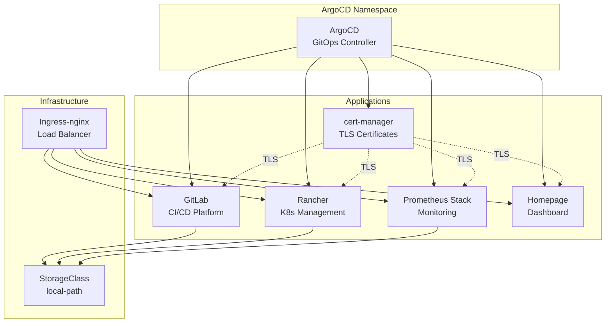

# ArgoCD Applications

Эта директория содержит ArgoCD Applications для управления приложениями в Kubernetes кластере через GitOps.

<details>
<summary><strong>🚀Быстрый старт</strong></summary>

---

**Минимальные шаги для развертывания всех приложений:**

1. **Настройте StorageClass:**
   ```bash
   kubectl apply -f https://raw.githubusercontent.com/rancher/local-path-provisioner/v0.0.24/deploy/local-path-storage.yaml
   kubectl patch storageclass local-path -p '{"metadata": {"annotations":{"storageclass.kubernetes.io/is-default-class":"true"}}}'
   ```

2. **Разверните cert-manager (обязательно первым):**
   ```bash
   kubectl apply -f 03-argocd/cert-manager/cert-manager.yaml
   kubectl wait --for=condition=ready pod -l app.kubernetes.io/instance=cert-manager -n cert-manager --timeout=300s
   kubectl apply -f 03-argocd/cert-manager/clusterissuer-selfsigned.yaml
   kubectl get clusterissuer selfsigned-issuer
   ```

3. **Разверните остальные приложения:**
   ```bash
   kubectl apply -f 03-argocd/gitlab/application.yaml
   kubectl apply -f 03-argocd/rancher/rancher.yaml
   kubectl apply -f 03-argocd/prometheus-stack/prometheus-stack.yaml
   kubectl apply -f 03-argocd/homepage/homepage.yaml
   kubectl apply -f 03-argocd/minio/minio-operator.yaml
   # После готовности Operator, развернуть Tenant:
   kubectl apply -f 03-argocd/minio/minio-tenant-app.yaml
   ```

📋**Детальные инструкции:** см. README каждого приложения в `applications/`

</details>

<details>
<summary><strong>📋Структура</strong></summary>

---

```
03-argocd/
├── cert-manager/
│   ├── cert-manager.yaml              # ArgoCD Application (Helm)
│   ├── clusterissuer-selfsigned.yaml  # ClusterIssuer для self-signed сертификатов
│   └── README.md                      # Документация
├── gitlab/
│   ├── application.yaml               # ArgoCD Application (Helm)
│   ├── certificate.yaml               # Certificate ресурс (опционально)
│   └── README.md                      # Документация
├── rancher/
│   ├── rancher.yaml                   # ArgoCD Application (Helm)
│   └── README.md                      # Документация
├── prometheus-stack/
│   ├── prometheus-stack.yaml          # ArgoCD Application (Helm)
│   └── README.md                      # Документация
├── homepage/
│   ├── homepage.yaml                  # ArgoCD Application (Kustomize)
│   ├── kustomization.yaml            # Kustomize конфигурация
│   ├── base/                          # Kustomize ресурсы
│   │   ├── deployment.yaml
│   │   ├── service.yaml
│   │   ├── ingress.yaml
│   │   ├── configmap.yaml
│   │   └── namespace.yaml
│   └── README.md                      # Документация
├── minio/
│   ├── minio-operator.yaml            # ArgoCD Application (Helm)
│   ├── minio-tenant.yaml              # MinIO Tenant CRD
│   └── README.md                      # Документация
└── README.md                          # Этот файл
```

</details>

<details>
<summary><strong>📋Предварительные требования</strong></summary>

---

1. **Kubernetes кластер версии 1.23+**
   ```bash
   kubectl version --short
   ```

2. **ArgoCD установлен и настроен**
   ```bash
   kubectl get pods -n argocd
   ```

3. **Ingress-nginx установлен**
   ```bash
   kubectl get pods -n ingress-nginx
   ```

4. **StorageClass настроен** для PersistentVolumes
   ```bash
   kubectl get storageclass
   ```

5. **Доступ к ArgoCD через UI или CLI**
   ```bash
   argocd app list
   ```

6. **Git репозиторий настроен в ArgoCD** (для Homepage)

</details>

<details>
<summary><strong>📋Доступные приложения</strong></summary>

---

### cert-manager

Автоматический менеджер TLS сертификатов для Kubernetes.

- **Файл**: `applications/cert-manager/cert-manager.yaml`
- **Namespace**: `cert-manager`
- **Тип**: Helm chart
- **Документация**: [`applications/cert-manager/README.md`](applications/cert-manager/README.md)

### GitLab

CI/CD платформа и управление репозиториями (облегченная версия).

- **Файл**: `applications/gitlab/application.yaml`
- **Namespace**: `gitlab`
- **Тип**: Helm chart
- **URL**: `https://gitlab.lab-home.com`
- **Документация**: [`applications/gitlab/README.md`](applications/gitlab/README.md)

### Rancher

Платформа управления Kubernetes кластерами.

- **Файл**: `applications/rancher/rancher.yaml`
- **Namespace**: `cattle-system`
- **Тип**: Helm chart
- **URL**: `https://rancher.lab-home.com`
- **Документация**: [`applications/rancher/README.md`](applications/rancher/README.md)

### Prometheus Stack

Полный стек мониторинга (Prometheus + Grafana + Alertmanager).

- **Файл**: `applications/prometheus-stack/prometheus-stack.yaml`
- **Namespace**: `monitoring`
- **Тип**: Helm chart
- **URL**: `https://grafana.lab-home.com`
- **Документация**: [`applications/prometheus-stack/README.md`](applications/prometheus-stack/README.md)

### Homepage

Современная домашняя страница/дашборд для самохостинга.

- **Файл**: `applications/homepage/homepage.yaml`
- **Namespace**: `homepage`
- **Тип**: Kustomize
- **URL**: `https://homepage.lab-home.com`
- **Документация**: [`applications/homepage/README.md`](applications/homepage/README.md)

### MinIO

S3-совместимое объектное хранилище для работы с Buckets в Rancher.

- **Файл**: `applications/minio/minio-operator.yaml`
- **Namespace**: `minio-operator`
- **Тип**: Helm chart (Operator) + CRD (Tenant)
- **URL**: `https://minio.lab-home.com` (Console)
- **Документация**: [`applications/minio/README.md`](applications/minio/README.md)

</details>

<details>
<summary><strong>⚙️Использование</strong></summary>

---

### Применение ArgoCD Applications

**Применение конкретного Application:**

```bash
# cert-manager (обязательно первым)
kubectl apply -f 03-argocd/cert-manager/cert-manager.yaml

# GitLab
kubectl apply -f 03-argocd/gitlab/application.yaml

# Rancher
kubectl apply -f 03-argocd/rancher/rancher.yaml

# Prometheus Stack
kubectl apply -f 03-argocd/prometheus-stack/prometheus-stack.yaml

# Homepage
kubectl apply -f 03-argocd/homepage/homepage.yaml

# MinIO Operator
kubectl apply -f 03-argocd/minio/minio-operator.yaml
```

**Применение всех Applications:**

```bash
# Применить все Applications рекурсивно
kubectl apply -f 03-argocd/ -R
```

### Проверка статуса

```bash
# Список всех Applications
kubectl get applications -n argocd

# Детали Application
kubectl describe application <app-name> -n argocd

# Через ArgoCD CLI
argocd app list
argocd app get <app-name>

# Статус всех приложений
kubectl get applications -n argocd -o wide
```

### Автоматическая синхронизация

Все Applications настроены с автоматической синхронизацией:
- `prune: true` - удаляет ресурсы, которых нет в конфигурации
- `selfHeal: true` - автоматически исправляет отклонения от желаемого состояния

ArgoCD автоматически синхронизирует Applications при изменениях в Git репозитории или кластере.

</details>

<details>
<summary><strong>⚠️Порядок развертывания приложений</strong></summary>

---

⚠️**КРИТИЧЕСКИ ВАЖНО:** Соблюдайте правильный порядок развертывания для приложений, использующих TLS:

### 1. cert-manager (обязательно первым)

Все приложения используют cert-manager для TLS сертификатов. Разверните cert-manager **до** всех остальных приложений:

```bash
# Развернуть cert-manager
kubectl apply -f 03-argocd/cert-manager/cert-manager.yaml

# Дождаться готовности
kubectl wait --for=condition=ready pod -l app.kubernetes.io/instance=cert-manager -n cert-manager --timeout=300s

# Создать ClusterIssuer
kubectl apply -f 03-argocd/cert-manager/clusterissuer-selfsigned.yaml

# Проверить ClusterIssuer
kubectl get clusterissuer selfsigned-issuer
# Должен быть в состоянии Ready
```

### 2. Приложения с TLS

Только после того, как cert-manager и ClusterIssuer готовы, развертывайте приложения:

```bash
# GitLab
kubectl apply -f 03-argocd/gitlab/application.yaml

# Rancher
kubectl apply -f 03-argocd/rancher/rancher.yaml

# Prometheus Stack (Grafana)
kubectl apply -f 03-argocd/prometheus-stack/prometheus-stack.yaml

# Homepage
kubectl apply -f 03-argocd/homepage/homepage.yaml

# MinIO Operator
kubectl apply -f 03-argocd/minio/minio-operator.yaml
```

**Если приложение развернуто до ClusterIssuer:**

Если приложение было развернуто до создания ClusterIssuer, Certificate может быть в состоянии `False`. Исправление:

```bash
# Для GitLab
kubectl delete secret gitlab-wildcard-tls gitlab-wildcard-tls-ca gitlab-wildcard-tls-chain -n gitlab

# Для Rancher
kubectl delete secret rancher-tls rancher-tls-ca rancher-tls-chain -n cattle-system

# Для Prometheus Stack (Grafana)
kubectl delete secret grafana-tls grafana-tls-ca grafana-tls-chain -n monitoring

# Для Homepage
kubectl delete secret homepage-tls homepage-tls-ca homepage-tls-chain -n homepage

# Для MinIO Console
kubectl delete secret minio-console-tls minio-console-tls-ca minio-console-tls-chain -n minio-operator

# cert-manager автоматически создаст новые секреты
# Проверить статус Certificate
kubectl get certificate -A
```

Подробнее см. раздел "Устранение неполадок" в README каждого приложения.

</details>

<details>
<summary><strong>📊Архитектура развертывания</strong></summary>

---



</details>

<details>
<summary><strong>🔧Устранение неполадок</strong></summary>

---

### Application не синхронизируется

**Решение**:
```bash
# Проверить логи ArgoCD
kubectl logs -n argocd -l app.kubernetes.io/name=argocd-application-controller

# Проверить статус Application
kubectl describe application <app-name> -n argocd

# Попробовать синхронизировать вручную
argocd app sync <app-name>
```

### Certificate не создается

**Причина**: Приложение развернуто до создания ClusterIssuer

**Решение**: См. раздел "Порядок развертывания приложений" выше или README конкретного приложения.

### Ошибка "private key does not match requirements" (GitLab)

Если при развертывании GitLab возникает ошибка о несоответствии приватного ключа:

```bash
# Обновить Certificate с правильной настройкой rotationPolicy
kubectl patch certificate gitlab-wildcard-tls -n gitlab --type merge -p '{"spec":{"privateKey":{"rotationPolicy":"Always"}}}'

# Удалить старые секреты для пересоздания
kubectl delete secret gitlab-wildcard-tls gitlab-wildcard-tls-ca gitlab-wildcard-tls-chain -n gitlab

# Проверить статус
kubectl get certificate gitlab-wildcard-tls -n gitlab
```

Подробнее см. раздел "Ошибка rotationPolicy" в `applications/gitlab/README.md`.

### Проблемы с Git репозиторием (Homepage)

**Решение**:
```bash
# Проверить доступность репозитория
argocd repo list

# Добавить репозиторий вручную
argocd repo add https://github.com/YOUR_USERNAME/YOUR_REPO.git --name lab-home --type git
```

</details>

<details>
<summary><strong>💡Подходы к развертыванию</strong></summary>

---

### Текущий подход: Отдельные Applications

Каждое приложение имеет свою директорию с Application манифестом. Это модульный подход, который позволяет:

- ✅ Легко управлять отдельными приложениями
- ✅ Добавлять дополнительные файлы (values.yaml, README.md и т.д.)
- ✅ Работать сразу, не требует настройки Git репозитория (кроме Homepage)
- ✅ Использовать разные типы источников (Helm, Kustomize)

### Типы источников

**Helm charts** (cert-manager, GitLab, Rancher, Prometheus Stack):
- Один файл с inline Helm values
- Helm chart из репозитория
- Простая структура

**Kustomize** (Homepage):
- Несколько манифестов в папке `base/`
- `kustomization.yaml` объединяет ресурсы
- Требует Git репозиторий в ArgoCD

### Автоматическая синхронизация

Все Applications настроены с автоматической синхронизацией:
- `prune: true` - удаляет ресурсы, которых нет в конфигурации
- `selfHeal: true` - автоматически исправляет отклонения от желаемого состояния

ArgoCD автоматически синхронизирует Applications при изменениях в Git репозитории или кластере.

</details>

<details>
<summary><strong>🔒Безопасность и TLS</strong></summary>

---

### Единый подход: cert-manager для всех приложений

Все приложения используют **cert-manager** для управления TLS сертификатами:

- ✅ **Единообразие** - один механизм для всех приложений
- ✅ **Автоматизация** - автоматическое создание и обновление сертификатов
- ✅ **Безопасность** - централизованное управление
- ✅ **Упрощение** - не нужно вручную управлять сертификатами

### Self-signed сертификаты (тестовая среда)

По умолчанию используется self-signed сертификаты через `selfsigned-issuer`:
- ⚠️ Браузеры покажут предупреждение о безопасности
- ✅ Не требует доступа к интернету
- ✅ Подходит для тестовой среды

### Let's Encrypt (production)

Для production окружения рекомендуется использовать Let's Encrypt:
- ✅ Валидные сертификаты
- ✅ Автоматическое обновление
- ⚠️ Требует доступность домена из интернета
- ⚠️ Требует правильную настройку DNS

См. `applications/cert-manager/README.md` для настройки Let's Encrypt.

</details>