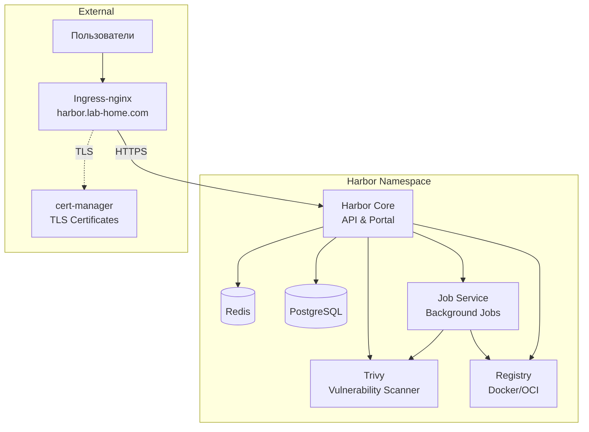

# Harbor ArgoCD Application

Этот каталог содержит конфигурацию для развертывания Harbor (registry образов Docker/OCI) через ArgoCD.

<details>
<summary><strong>🚀 Быстрый старт</strong></summary>

---

**Минимальные шаги для развертывания Harbor:**

1. **Настройте StorageClass (если еще не настроен):**
   ```bash
   kubectl apply -f https://raw.githubusercontent.com/rancher/local-path-provisioner/v0.0.24/deploy/local-path-storage.yaml
   kubectl patch storageclass local-path -p '{"metadata": {"annotations":{"storageclass.kubernetes.io/is-default-class":"true"}}}'
   ```

2. **Разверните cert-manager (обязательно перед Harbor):**
   ```bash
   kubectl apply -f 03-argocd/cert-manager/cert-manager.yaml
   kubectl wait --for=condition=ready pod -l app.kubernetes.io/instance=cert-manager -n cert-manager --timeout=300s
   kubectl apply -f 03-argocd/cert-manager/clusterissuer-selfsigned.yaml
   kubectl get clusterissuer selfsigned-issuer
   ```

3. **Примените ArgoCD Application для Harbor:**
   ```bash
   kubectl apply -f 03-argocd/harbor/application.yaml
   ```

4. **Дождитесь готовности (5–15 минут):**
   ```bash
   kubectl get pods -n harbor -w
   # Все поды должны перейти в состояние Running
   ```

5. **Войдите в Harbor:**
   - URL: `https://harbor.lab-home.com`
   - Логин: `admin`
   - Пароль: по умолчанию `ChangeMeAfterInstall` — **обязательно смените** после первого входа (см. секцию «Пароль администратора»).

📋 **Детальные инструкции:** см. секции ниже

</details>

<details>
<summary><strong>📋 Описание и компоненты</strong></summary>

---

Harbor — open-source registry образов (Docker/OCI) с веб-интерфейсом, сканированием уязвимостей, подписью образов и управлением проектами.

### Компоненты

- **Core** — API и веб-портал Harbor
- **Registry** — хранение образов (Distribution)
- **Job Service** — фоновые задачи (репликация, сканирование, очистка)
- **Portal** — веб-интерфейс
- **Trivy** — сканирование образов на уязвимости
- **PostgreSQL** — база данных (внутренняя)
- **Redis** — кэш и очереди (внутренний)

### Архитектура развертывания



### Основные параметры

- **Файл Application**: `03-argocd/harbor/application.yaml`
- **Namespace**: `harbor`
- **Тип источника**: Git (распакованный чарт Harbor 1.18.0 в `helm/charts/harbor-1.18.0`, values в `helm/custom-values/lab-home.yaml`)
- **URL**: `https://harbor.lab-home.com`

</details>

<details>
<summary><strong>📋 Структура файлов</strong></summary>

---

```
harbor/
├── application.yaml              # Application (prod)
├── application-test.yaml         # Application для тестового инстанса (namespace harbor-test)
├── helm/
│   ├── charts/
│   │   └── harbor-1.18.0/        # Распакованный чарт Harbor 1.18.0
│   │       ├── Chart.yaml
│   │       ├── values.yaml
│   │       └── templates/
│   └── custom-values/
│       └── lab-home.yaml         # переопределение для prod
└── README.md
```

**Примечание**: Namespace `harbor` создаётся автоматически через `CreateNamespace=true`.

</details>

<details>
<summary><strong>📋 Предварительные требования</strong></summary>

---

1. **Kubernetes кластер версии 1.23+**
   ```bash
   kubectl version --short
   ```

2. **ArgoCD установлен и настроен**
   ```bash
   kubectl get pods -n argocd
   ```

3. **Ingress-nginx установлен**
   ```bash
   kubectl get pods -n ingress-nginx
   ```

4. **StorageClass настроен** для PersistentVolumes
   ```bash
   kubectl get storageclass
   ```

5. **cert-manager установлен и настроен** (см. секцию «Быстрый старт»)
   ```bash
   kubectl get clusterissuer selfsigned-issuer
   ```

6. **Доступ к GitHub** из кластера (для источника Git) или к `https://helm.goharbor.io` (если переключитесь на Helm repo)

7. **DNS настроен** для домена `harbor.lab-home.com` (или измените в конфигурации)

</details>

<details>
<summary><strong>⚙️ Установка</strong></summary>

---

### 1. Настройка StorageClass

Настройте StorageClass для PVC (если еще не настроен):

```bash
kubectl apply -f https://raw.githubusercontent.com/rancher/local-path-provisioner/v0.0.24/deploy/local-path-storage.yaml
kubectl patch storageclass local-path -p '{"metadata": {"annotations":{"storageclass.kubernetes.io/is-default-class":"true"}}}'
kubectl get storageclass
```

### 2. Развертывание cert-manager

Harbor использует cert-manager для TLS. Разверните cert-manager **до** Harbor:

```bash
kubectl apply -f 03-argocd/cert-manager/cert-manager.yaml
kubectl wait --for=condition=ready pod -l app.kubernetes.io/instance=cert-manager -n cert-manager --timeout=300s
kubectl get pods -n cert-manager
```

### 3. Создание ClusterIssuer

```bash
kubectl apply -f 03-argocd/cert-manager/clusterissuer-selfsigned.yaml
kubectl get clusterissuer selfsigned-issuer
# Должен быть в состоянии Ready
```

### 4. Применение ArgoCD Application для Harbor

```bash
kubectl apply -f 03-argocd/harbor/application.yaml
kubectl get application harbor -n argocd
kubectl describe application harbor -n argocd
```

После развертывания cert-manager создаст Certificate для Harbor по аннотациям Ingress.

### 5. Проверка статуса развертывания

#### Через ArgoCD CLI

```bash
argocd app list
argocd app get harbor
argocd app sync harbor
```

#### Через kubectl

```bash
kubectl get pods -n harbor
kubectl get certificate -n harbor
kubectl get ingress -n harbor
```

### Время развертывания

- **Ожидаемое время**: 5–15 минут
- Зависит от скорости загрузки образов и инициализации БД
- Все поды должны перейти в состояние `Running`
- Certificate должен стать Ready

</details>

<details>
<summary><strong>🔍 Доступ и первоначальная настройка</strong></summary>

---

### Доступ к Harbor

- **URL**: `https://harbor.lab-home.com`
- **Логин**: `admin`
- **Пароль**: по умолчанию `ChangeMeAfterInstall` (смените при первом входе)

### Первый вход

1. Откройте браузер: `https://harbor.lab-home.com`
2. Войдите как `admin` с паролем из конфигурации
3. Сразу смените пароль: *Administration → Users → admin → Change Password*

### Предупреждение о сертификате (self-signed)

При использовании self-signed сертификатов браузер покажет предупреждение. Для тестовой среды: «Advanced» → «Proceed to harbor.lab-home.com».

### Docker login

После создания проекта в Harbor:

```bash
docker login harbor.lab-home.com
# Username: admin (или пользователь проекта)
# Password: (ваш пароль)
```

</details>

<details>
<summary><strong>🔍 Проверка статуса развертывания</strong></summary>

---

### Проверка подов

```bash
kubectl get pods -n harbor
kubectl get pods -n harbor -o wide
kubectl describe pod <pod-name> -n harbor
watch kubectl get pods -n harbor
```

Ожидаемый результат — все поды в состоянии `Running` (core, registry, jobservice, portal, trivy, database, redis и др.).

### Проверка логов

```bash
kubectl logs -n harbor -l app=harbor --tail=50 -c core
kubectl logs -n harbor -l app=harbor --tail=50 -c registry
```

### Проверка сервисов и Ingress

```bash
kubectl get svc -n harbor
kubectl get ingress -n harbor
kubectl describe ingress -n harbor
curl -I https://harbor.lab-home.com -k
```

### Проверка Certificate

```bash
kubectl get certificate -n harbor
kubectl describe certificate harbor-tls -n harbor
kubectl get secret harbor-tls -n harbor
```

### Использование ресурсов

```bash
kubectl top pods -n harbor
kubectl get events -n harbor --sort-by='.lastTimestamp'
kubectl get all -n harbor
```

</details>

<details>
<summary><strong>⚙️ Конфигурация</strong></summary>

---

### Пароль администратора

В манифесте по умолчанию задан пароль `ChangeMeAfterInstall`. Варианты:

1. **Сменить после первого входа** в веб-интерфейсе: *Administration → Users → admin → Change Password*.

2. **Задать до развертывания** в `helm/custom-values/lab-home.yaml` (не коммитьте реальные пароли в Git):
   ```yaml
   harborAdminPassword: "ВашПароль"
   ```

3. **Использовать существующий Secret** с ключом `HARBOR_ADMIN_PASSWORD`:
   - Создайте Secret в namespace `harbor`.
   - В `helm/custom-values/lab-home.yaml` добавьте (на верхнем уровне):
     ```yaml
     existingSecretAdminPassword: "my-harbor-admin-secret"
     ```
   - Поле `harborAdminPassword` при наличии секрета не используется.

### Хранилище и StorageClass

По умолчанию используется default StorageClass кластера. Чтобы задать свой (например, `local-path`), в блоке `persistence.persistentVolumeClaim` в `helm/custom-values/lab-home.yaml`:

```yaml
persistence:
  persistentVolumeClaim:
    registry:
      storageClass: "local-path"
      size: 5Gi
    jobservice:
      jobLog:
        storageClass: "local-path"
        size: 1Gi
    database:
      storageClass: "local-path"
      size: 1Gi
    redis:
      storageClass: "local-path"
      size: 1Gi
    trivy:
      storageClass: "local-path"
      size: 5Gi
```

Размеры по умолчанию: registry 5Gi, jobservice 1Gi, database 1Gi, redis 1Gi, trivy 5Gi.

</details>

<details>
<summary><strong>🔧 Устранение неполадок</strong></summary>

---

### Certificate не создаётся или не Ready

**Симптомы**: `kubectl get certificate -n harbor` — Certificate в состоянии `False`.

**Решение**: Убедитесь, что cert-manager и ClusterIssuer развернуты **до** Harbor. Если Harbor был применён раньше:

```bash
kubectl delete secret harbor-tls harbor-tls-ca harbor-tls-chain -n harbor
# cert-manager пересоздаст секреты по аннотациям Ingress
kubectl get certificate -n harbor
```

### Поды в состоянии Pending

**Причина**: Нет StorageClass или недостаточно ресурсов.

**Решение**:
```bash
kubectl describe pod <pod-name> -n harbor
kubectl get pvc -n harbor
kubectl get storageclass
kubectl top nodes
```

### Поды в CrashLoopBackOff или не стартуют

**Решение**:
```bash
kubectl logs -n harbor <pod-name> --previous
kubectl describe pod <pod-name> -n harbor
kubectl get events -n harbor --sort-by='.lastTimestamp'
```

### Failed to load target state: context deadline exceeded

**Причина**: Таймаут при обращении к Helm repo `https://helm.goharbor.io` из кластера.

**Решение**: В конфигурации уже используется источник **Git** вместо Helm repo. Если ошибка при Git-источнике — проверьте доступность GitHub из кластера и при необходимости добавьте репозиторий в ArgoCD (Settings → Repositories).

### Harbor недоступен по HTTPS после развертывания

**Решение**:
```bash
kubectl get pods -n harbor
kubectl get ingress -n harbor
kubectl get certificate -n harbor
# Дождитесь Ready всех подов и Certificate; проверьте логи core
kubectl logs -n harbor -l app=harbor -c core --tail=100
```

### Application не синхронизируется в ArgoCD

**Решение**:
```bash
kubectl logs -n argocd -l app.kubernetes.io/name=argocd-application-controller
kubectl describe application harbor -n argocd
argocd app sync harbor
```

</details>

<details>
<summary><strong>🔒 Включение SSL/TLS</strong></summary>

---

**Порядок развертывания**

1. Разверните cert-manager и дождитесь готовности подов.
2. Создайте ClusterIssuer (`clusterissuer-selfsigned.yaml`).
3. Убедитесь, что `kubectl get clusterissuer selfsigned-issuer` показывает Ready.
4. Только после этого применяйте Application.

**Если Harbor развернут до ClusterIssuer**

```bash
kubectl delete secret harbor-tls harbor-tls-ca harbor-tls-chain -n harbor
kubectl get certificate -n harbor
# Certificate должен перейти в Ready
```

**Для production (Let's Encrypt)**

В `helm/custom-values/lab-home.yaml` в аннотациях Ingress замените:

```yaml
cert-manager.io/cluster-issuer: "letsencrypt-prod"
```

(при условии, что соответствующий ClusterIssuer создан в cert-manager).

</details>

<details>
<summary><strong>💡 Рекомендации</strong></summary>

---

### Для production

1. Задайте пароль администратора через Secret (`existingSecretAdminPassword`), не храните пароль в Git.
2. Укажите явный StorageClass и при необходимости увеличьте размер PVC для registry.
3. Используйте Let's Encrypt вместо self-signed сертификатов.
4. Настройте резервное копирование — см. **[docs/BACKUPS.md](docs/BACKUPS.md)** (Velero или ручной бэкап БД и PVC registry).
5. Ограничьте доступ к Harbor по сети (firewall, VPN) и используйте сильные пароли.

</details>

<details>
<summary><strong>⚠️ Важные замечания</strong></summary>

---

**Для тестовой среды:**
- Используется self-signed сертификат (предупреждение в браузере)
- Пароль по умолчанию — смените после первого входа
- Подходит для разработки и тестирования

**Для production:**
- Обязательно смените пароль admin или используйте Secret
- Настройте TLS (предпочтительно Let's Encrypt)
- Задайте StorageClass и размеры PVC под нагрузку
- Настройте резервное копирование

</details>
