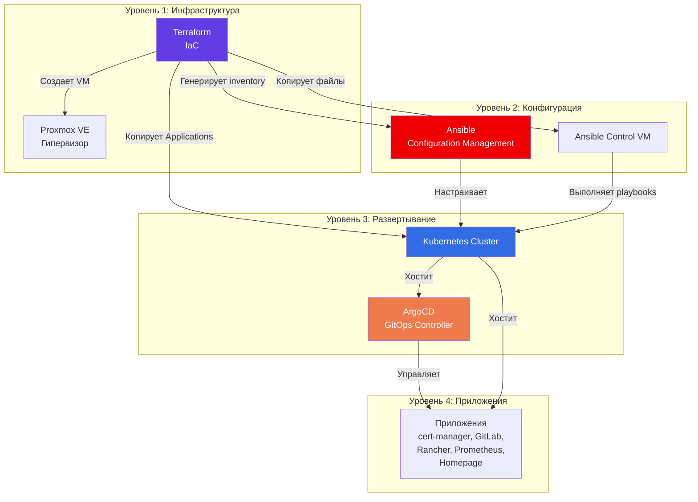
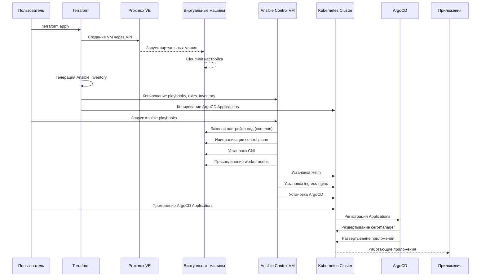
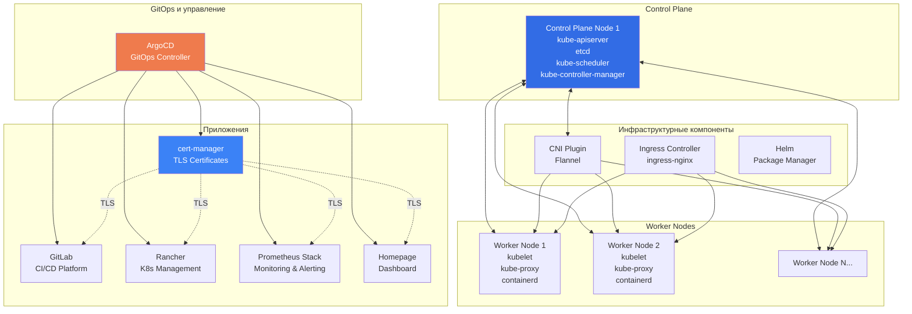
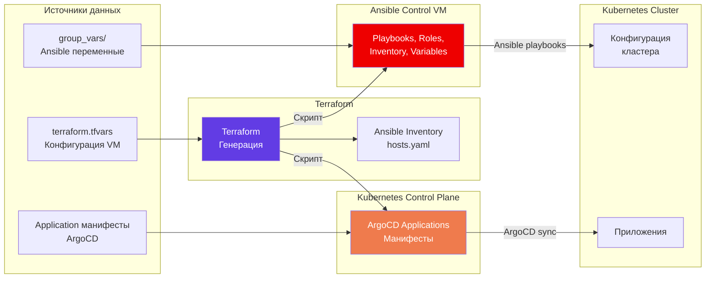

# Lab Home

## О проекте

**Lab Home** — это комплексная система для автоматизированного развертывания и управления Kubernetes кластером на базе Proxmox VE. Проект реализует полный цикл создания инфраструктуры: от виртуальных машин до работающих приложений, используя современные подходы Infrastructure as Code и GitOps.

### Назначение

Проект предназначен для:
- Автоматизации создания и настройки Kubernetes кластера
- Управления инфраструктурой через декларативные конфигурации
- Развертывания приложений по принципам GitOps
- Создания воспроизводимой и масштабируемой инфраструктуры

### Целевая аудитория

- DevOps инженеры, настраивающие Kubernetes инфраструктуру
- Системные администраторы, автоматизирующие развертывание
- Разработчики, изучающие практики IaC и GitOps

---

## Общая архитектура системы

Система состоит из трех основных компонентов, работающих последовательно и обеспечивающих полную автоматизацию развертывания:



### Взаимосвязи компонентов

1. **Terraform** создает базовую инфраструктуру (виртуальные машины) и подготавливает среду для следующих этапов
2. **Ansible** конфигурирует созданные виртуальные машины и развертывает Kubernetes кластер
3. **ArgoCD** управляет жизненным циклом приложений в кластере через GitOps подход

---

## Компоненты системы

### 1. Terraform (01-terraform)

**Назначение:** Создание и управление инфраструктурой виртуальных машин

**Основные функции:**
- Создание виртуальных машин в Proxmox VE с использованием cloud-init
- Генерация Ansible inventory на основе созданных VM
- Автоматическое копирование конфигурационных файлов на целевые хосты
- Управление сетевыми настройками и ресурсами VM

**Входные данные:**
- Конфигурация виртуальных машин (количество, ресурсы, IP-адреса)
- Параметры подключения к Proxmox (endpoint, API токен)
- Сетевые параметры (gateway, CIDR, bridge)

**Выходные данные:**
- Созданные виртуальные машины в Proxmox
- Ansible inventory файл (`02-ansible/inventory/prod/hosts.yaml`)
- Скопированные файлы на Ansible Control VM
- Скопированные ArgoCD Applications на Kubernetes control plane

**Архитектурные особенности:**
- Модульная структура для переиспользования конфигураций
- Использование шаблонов для генерации конфигураций
- Автоматизация передачи данных между этапами развертывания

### 2. Ansible (02-ansible)

**Назначение:** Конфигурация и развертывание Kubernetes кластера

**Основные функции:**
- Базовая настройка всех узлов кластера
- Инициализация Kubernetes control plane
- Присоединение worker nodes к кластеру
- Установка сетевого плагина (CNI)
- Развертывание инфраструктурных компонентов (Helm, Ingress Controller, ArgoCD)
- Установка мониторинга на Proxmox хосты

**Входные данные:**
- Ansible inventory (генерируется Terraform)
- Playbooks и roles для различных компонентов
- Переменные конфигурации (версии, домены, сетевые параметры)

**Выходные данные:**
- Полностью настроенный Kubernetes кластер
- Установленные инфраструктурные компоненты
- Готовый к работе ArgoCD для управления приложениями

**Архитектурные особенности:**
- Разделение логики на roles для переиспользования
- Playbooks как оркестраторы, объединяющие roles
- Конфигурация через переменные в group_vars
- Идемпотентность операций

### 3. ArgoCD Applications (03-argocd)

**Назначение:** Управление приложениями в Kubernetes кластере через GitOps

**Основные функции:**
- Декларативное определение приложений через Application манифесты
- Автоматическая синхронизация состояния приложений
- Управление зависимостями между приложениями
- Self-healing (автоматическое восстановление желаемого состояния)

**Входные данные:**
- Application манифесты для каждого приложения
- Helm charts или Kustomize конфигурации
- Параметры развертывания (values, переменные)

**Выходные данные:**
- Работающие приложения в Kubernetes кластере
- Автоматически управляемые сертификаты TLS
- Мониторинг и алертинг
- CI/CD платформы и инструменты управления

**Архитектурные особенности:**
- GitOps подход: состояние в Git = состояние в кластере
- Автоматическая синхронизация и самовосстановление
- Поддержка различных источников (Helm, Kustomize)
- Централизованное управление TLS через cert-manager

---

## Жизненный цикл развертывания

Процесс развертывания проходит через последовательные этапы, где каждый этап подготавливает основу для следующего:



### Этапы развертывания

#### Этап 1: Создание инфраструктуры (Terraform)
- Определение конфигурации VM в `terraform.tfvars`
- Выполнение `terraform apply`
- Создание виртуальных машин в Proxmox
- Автоматическая настройка через cloud-init
- Генерация и копирование конфигурационных файлов

#### Этап 2: Конфигурация кластера (Ansible)
- Подключение к Ansible Control VM
- Выполнение playbooks для настройки узлов
- Инициализация Kubernetes control plane
- Установка сетевого плагина
- Присоединение worker nodes
- Развертывание инфраструктурных компонентов

#### Этап 3: Развертывание приложений (ArgoCD)
- Применение ArgoCD Application манифестов
- Автоматическое развертывание cert-manager (первым)
- Развертывание остальных приложений
- Автоматическая настройка TLS сертификатов
- Мониторинг состояния через ArgoCD UI

---

## Архитектура Kubernetes кластера

### Структура кластера

Кластер состоит из следующих компонентов:



### Компоненты кластера

#### Инфраструктурные компоненты

1. **CNI (Flannel)**
   - Обеспечивает сетевую связность между подами
   - Использует VXLAN для создания overlay сети
   - Необходим для работы кластера

2. **Ingress Controller (ingress-nginx)**
   - Маршрутизация внешнего трафика в кластер
   - Управление входящими HTTP/HTTPS соединениями
   - Интеграция с cert-manager для автоматического TLS

3. **Helm**
   - Пакетный менеджер для Kubernetes
   - Упрощает установку и управление приложениями
   - Используется для развертывания большинства компонентов

#### Приложения

1. **cert-manager**
   - Автоматическое управление TLS сертификатами
   - Интеграция с различными провайдерами (Let's Encrypt, self-signed)
   - Централизованное управление сертификатами для всех приложений

2. **GitLab**
   - CI/CD платформа и управление репозиториями
   - Интеграция с Kubernetes для деплоя
   - Управление исходным кодом и артефактами

3. **Rancher**
   - Платформа управления Kubernetes кластерами
   - Упрощенный интерфейс для управления кластером
   - Мультикластерное управление

4. **Prometheus Stack**
   - Сбор метрик (Prometheus)
   - Визуализация (Grafana)
   - Алертинг (Alertmanager)
   - Мониторинг кластера и приложений

5. **Homepage**
   - Современный дашборд для самохостинга
   - Единая точка доступа к приложениям
   - Навигация по сервисам

---

## Принципы проектирования

### Infrastructure as Code (IaC)

Вся инфраструктура описывается декларативно в виде кода:
- **Версионирование:** все изменения отслеживаются в Git
- **Воспроизводимость:** идентичная инфраструктура может быть создана многократно
- **Документированность:** код служит документацией
- **Тестируемость:** возможность проверки изменений перед применением

### GitOps подход

Управление приложениями через Git репозиторий:
- **Декларативность:** желаемое состояние описывается в манифестах
- **Автоматизация:** ArgoCD автоматически синхронизирует состояние
- **Прозрачность:** все изменения видны в Git истории
- **Откат изменений:** простое возвращение к предыдущему состоянию

### Модульность и переиспользование

Компоненты системы организованы как переиспользуемые модули:
- **Terraform модули:** переиспользование конфигураций VM
- **Ansible roles:** изолированная логика для каждого компонента
- **Helm charts:** стандартизированное развертывание приложений
- **Разделение ответственности:** каждый компонент решает свою задачу

### Разделение ответственности

Четкое разделение между этапами:
- **Terraform:** создание инфраструктуры
- **Ansible:** конфигурация и настройка
- **ArgoCD:** управление приложениями
- Каждый инструмент используется для своей области компетенции

### Идемпотентность

Операции могут выполняться многократно с одинаковым результатом:
- Ansible playbooks идемпотентны по своей природе
- Terraform отслеживает состояние и применяет только изменения
- ArgoCD поддерживает желаемое состояние автоматически

---

## Структура проекта

Проект организован в три основные директории, каждая из которых отвечает за свой этап развертывания:

```
lab-home/
├── 01-terraform/          # Создание инфраструктуры
│   ├── live/              # Конфигурация для конкретного окружения
│   │   ├── main.tf        # Основная конфигурация
│   │   ├── variables.tf   # Определение переменных
│   │   ├── scripts/       # Скрипты копирования файлов
│   │   └── templates/     # Шаблоны для генерации конфигураций
│   └── modules/           # Переиспользуемые Terraform модули
│
├── 02-ansible/            # Конфигурация и развертывание
│   ├── inventory/         # Inventory файлы по окружениям
│   │   └── prod/          # Production окружение
│   │       ├── hosts.yaml # Генерируется Terraform
│   │       └── group_vars/# Переменные для групп хостов
│   ├── playbooks/         # Ansible playbooks
│   │   ├── site.yml       # Главный playbook
│   │   ├── k8s/           # Kubernetes развертывание
│   │   ├── helm/          # Установка Helm
│   │   ├── ingress-nginx/ # Ingress контроллер
│   │   └── argocd/        # ArgoCD развертывание
│   └── roles/             # Ansible roles (логика компонентов)
│
└── 03-argocd/# Управление приложениями
    └── applications/      # ArgoCD Application манифесты
        ├── cert-manager/  # TLS сертификаты
        ├── gitlab/        # GitLab CI/CD
        ├── rancher/       # Rancher управление
        ├── prometheus-stack/# Мониторинг
        └── homepage/      # Дашборд
```

### Логическая организация

1. **01-terraform/** — инфраструктурный слой
   - Создание виртуальных машин
   - Подготовка среды для конфигурации
   - Генерация конфигурационных файлов

2. **02-ansible/** — конфигурационный слой
   - Настройка операционной системы
   - Развертывание Kubernetes
   - Установка инфраструктурных компонентов

3. **03-argocd/** — прикладной слой
   - Определение приложений
   - Управление жизненным циклом
   - Автоматизация развертывания

---

## Потоки данных

### Передача конфигураций между этапами



### Автоматизация передачи данных

1. **Terraform → Ansible**
   - Автоматическая генерация inventory на основе созданных VM
   - Копирование playbooks, roles и переменных через скрипт `push_ansible_files.sh`
   - Настройка структуры директорий на Ansible Control VM

2. **Terraform → Kubernetes**
   - Копирование ArgoCD Application манифестов на control plane через скрипт `push_argocd_applications.sh`
   - Подготовка файлов для последующего применения через kubectl

3. **Ansible → Kubernetes**
   - Применение конфигураций через kubectl и Helm
   - Установка компонентов кластера
   - Настройка сетевых и системных параметров

4. **ArgoCD → Приложения**
   - Чтение Application манифестов из Git или файловой системы
   - Автоматическая синхронизация состояния приложений
   - Управление зависимостями между приложениями

### Конфигурационные файлы

**Источники конфигурации:**
- `terraform.tfvars` — параметры инфраструктуры
- `group_vars/*.yaml` — переменные Ansible для групп хостов
- `values.yaml` — параметры Helm charts
- Application манифесты — декларативное описание приложений

**Автоматическая генерация:**
- Ansible inventory генерируется Terraform на основе `vm_list`
- Cloud-init конфигурации создаются из шаблонов
- Конфигурации передаются автоматически через скрипты

---

## Заключение

Проект **Lab Home** представляет собой комплексное решение для автоматизированного развертывания Kubernetes инфраструктуры, объединяющее лучшие практики Infrastructure as Code и GitOps. Архитектура системы обеспечивает:

- **Полную автоматизацию** процесса развертывания
- **Воспроизводимость** инфраструктуры
- **Масштабируемость** и возможность расширения
- **Управляемость** через декларативные конфигурации
- **Надежность** через идемпотентные операции

Каждый компонент системы решает свою задачу, а их интеграция обеспечивает плавный переход от создания виртуальных машин до работающих приложений в Kubernetes кластере.

---