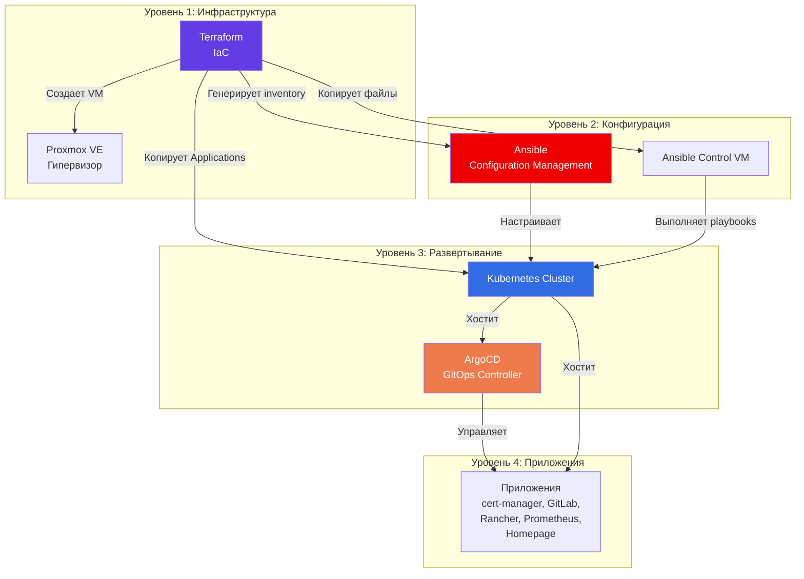

# 🏠lab-home

## О проекте

**lab-home** - это домашняя платформа для экспериментов с Kubernetes. Система автоматически поднимает виртуальные машины в Proxmox, настраивает кластер через Ansible и разворачивает приложения с помощью ArgoCD. В итоге получается полностью воспроизводимая инфраструктура, которую можно пересоздать в любой момент.

---

## Общая архитектура системы

Система состоит из трех основных компонентов, работающих последовательно и обеспечивающих полную автоматизацию развертывания:



### Взаимосвязи компонентов

1. **Terraform** создает базовую инфраструктуру (виртуальные машины) и подготавливает среду для следующих этапов
2. **Ansible** конфигурирует созданные виртуальные машины и развертывает Kubernetes кластер
3. **ArgoCD** управляет жизненным циклом приложений в кластере через GitOps подход

---

<details>
<summary><b>🚀Быстрый старт</b></summary>

### Предварительные требования

Перед началом развертывания убедитесь, что у вас есть:

- **Terraform** >= 1.0 установлен и доступен в PATH
- **Доступ к Proxmox VE** с правами на создание виртуальных машин
- **SSH ключ** для подключения к создаваемым VM
- **ISO образ Ubuntu** загружен в Proxmox (например, `noble-server-cloudimg-amd64.img`)

### Пошаговая инструкция

#### Шаг 1: Подготовка конфигурации Terraform

Заполните файл `terraform.tfvars` по примеру `terraform.tfvars.example`:

```bash
cd 01-terraform/proxmox/vm-ubuntu/live
cp terraform.tfvars.example terraform.tfvars
# Отредактируйте terraform.tfvars и заполните реальными значениями
```

**Важно:** Укажите корректные значения для:
- `proxmox_endpoint` - URL вашего Proxmox API
- `proxmox_api_token` - API токен для Terraform
- `ssh_public_key` - ваш публичный SSH ключ
- `vm_list` - список виртуальных машин с IP-адресами и ресурсами

#### Шаг 2: Загрузка ISO образа в Proxmox

В веб-интерфейсе Proxmox:

1. Перейдите в **Datacenter** → выберите **node** → **local** → **ISO Images**
2. Загрузите ISO образ (например, `noble-server-cloudimg-amd64.img`)
3. Убедитесь, что образ доступен в хранилище, указанном в `terraform.tfvars` (обычно `local:iso/`)

#### Шаг 3: Тестирование конфигурации Terraform

Перед применением проверьте план развертывания:

```bash
cd 01-terraform/proxmox/vm-ubuntu/live

# Инициализация Terraform (если еще не выполнено)
terraform init

# Просмотр плана изменений
terraform plan
```

Проверьте, что план соответствует ожиданиям: количество VM, их ресурсы, IP-адреса.

#### Шаг 4: Применение конфигурации Terraform

Создайте виртуальные машины:

```bash
cd 01-terraform/proxmox/vm-ubuntu/live
terraform apply
```

Terraform автоматически:
- Создаст виртуальные машины в Proxmox
- Настроит cloud-init конфигурации
- Сгенерирует Ansible inventory файл
- Скопирует файлы на Ansible Control VM (`/etc/ansible/`)
- Скопирует ArgoCD Applications на Kubernetes control plane (`~/03-argocd/`)

**Примечание:** После `terraform apply` подождите 2-3 минуты, пока VM полностью загрузятся и станут доступны по SSH. Terraform скрипты автоматически ожидают готовности хостов.

#### Шаг 5: Развертывание Kubernetes кластера через Ansible

Подключитесь к Ansible Control VM и запустите главный playbook:

```bash
# Подключение к Ansible Control VM
# IP-адрес можно получить из terraform output или из terraform.tfvars
ssh -i 01-terraform/proxmox/vm-ubuntu/live/keys/id_ed25519 ubuntu@<ANSIBLE_CONTROL_IP>

# Переход в директорию с playbooks
cd /etc/ansible/playbooks

# Запуск главного playbook
ansible-playbook site.yml -i inventory/prod/hosts.yaml
```

Playbook выполнит автоматически:
1. Базовую настройку всех узлов кластера
2. Инициализацию Kubernetes control plane
3. Установку CNI (Flannel)
4. Присоединение worker nodes
5. Установку Helm
6. Установку ingress-nginx
7. Установку ArgoCD

**Важно:** После завершения playbook автоматически выведет:
- Логин и пароль для доступа к ArgoCD (логин: `admin`)
- URL для доступа к ArgoCD через ingress

#### Шаг 6: Настройка DNS и доступ к ArgoCD

Для доступа к ArgoCD через веб-интерфейс необходимо настроить DNS на вашей машине:

**Windows** (`C:\Windows\System32\drivers\etc\hosts`):
```
<IP-адрес_k8s-control-01> argocd.lab-home.com
```

**Linux/macOS** (`/etc/hosts`):
```
<IP-адрес_k8s-control-01> argocd.lab-home.com
```

Замените `<IP-адрес_k8s-control-01>` на реальный IP-адрес вашего Kubernetes control plane узла (например, `192.168.40.145`)

**Примечание:** Если вы планируете развертывать дополнительные приложения через ArgoCD, добавьте их домены в hosts файл:

**Windows** (`C:\Windows\System32\drivers\etc\hosts`):

**Linux/macOS** (`/etc/hosts`):
```
<IP-адрес_k8s-control-01> argocd.lab-home.com
<IP-адрес_k8s-control-01> rancher.lab-home.com
<IP-адрес_k8s-control-01> gitlab.lab-home.com
<IP-адрес_k8s-control-01> homepage.lab-home.com
<IP-адрес_k8s-control-01> grafana.lab-home.com
```

После настройки DNS откройте в браузере:
```
https://argocd.lab-home.com:30443/
```

Используйте учетные данные, выведенные при выполнении Ansible playbook (логин: `admin`, пароль из вывода playbook).

#### Шаг 7: Развертывание ArgoCD Applications

Подключитесь к Kubernetes control plane и примените манифесты ArgoCD Applications:

```bash
# Подключение к k8s-control-01
ssh -i 01-terraform/proxmox/vm-ubuntu/live/keys/id_ed25519 ubuntu@<K8S_CONTROL_IP>

# Применение манифестов (начинаем с cert-manager, так как он требуется для TLS)
cd ~/03-argocd/cert-manager
kubectl apply -f cert-manager.yaml

# Применение остальных Applications (опционально, можно применить все сразу)
kubectl apply -f ~/03-argocd/cert-manager/clusterissuer-selfsigned.yaml
kubectl apply -f ~/03-argocd/cert-manager/clusterissuer-application.yaml
```

**Примечание:** ArgoCD Applications автоматически копируются Terraform в директорию `~/03-argocd/` на k8s-control-01. Вы можете применить их все сразу или по отдельности в зависимости от ваших потребностей.

### Проверка результата

После выполнения всех шагов у вас должен быть:

- ✅ Работающий Kubernetes кластер
- ✅ ArgoCD доступен по адресу `https://argocd.lab-home.com:30443/`
- ✅ Ingress Controller настроен и работает
- ✅ ArgoCD Applications готовы к применению

Для проверки состояния кластера:
```bash
# На k8s-control-01
kubectl get nodes
kubectl get pods -A
kubectl get ingress -A
```

</details>

---

<details>
<summary><b>📦Компоненты системы</b></summary>

### 1. Terraform (01-terraform)

**Назначение:** Создание и управление инфраструктурой виртуальных машин

**Основные функции:**
- Создание виртуальных машин в Proxmox VE с использованием cloud-init
- Генерация Ansible inventory на основе созданных VM
- Автоматическое копирование конфигурационных файлов на целевые хосты
- Управление сетевыми настройками и ресурсами VM

**Входные данные:**
- Конфигурация виртуальных машин (количество, ресурсы, IP-адреса)
- Параметры подключения к Proxmox (endpoint, API токен)
- Сетевые параметры (gateway, CIDR, bridge)

**Выходные данные:**
- Созданные виртуальные машины в Proxmox
- Ansible inventory файл (`02-ansible/inventory/prod/hosts.yaml`)
- Скопированные файлы на Ansible Control VM
- Скопированные ArgoCD Applications на Kubernetes control plane

**Архитектурные особенности:**
- Модульная структура для переиспользования конфигураций
- Использование шаблонов для генерации конфигураций
- Автоматизация передачи данных между этапами развертывания

### 2. Ansible (02-ansible)

**Назначение:** Конфигурация и развертывание Kubernetes кластера

**Основные функции:**
- Базовая настройка всех узлов кластера
- Инициализация Kubernetes control plane
- Присоединение worker nodes к кластеру
- Установка сетевого плагина (CNI)
- Развертывание инфраструктурных компонентов (Helm, Ingress Controller, ArgoCD)
- Установка мониторинга на Proxmox хосты

**Входные данные:**
- Ansible inventory (генерируется Terraform)
- Playbooks и roles для различных компонентов
- Переменные конфигурации (версии, домены, сетевые параметры)

**Выходные данные:**
- Полностью настроенный Kubernetes кластер
- Установленные инфраструктурные компоненты
- Готовый к работе ArgoCD для управления приложениями

**Архитектурные особенности:**
- Разделение логики на roles для переиспользования
- Playbooks как оркестраторы, объединяющие roles
- Конфигурация через переменные в group_vars
- Идемпотентность операций

### 3. ArgoCD Applications (03-argocd)

**Назначение:** Управление приложениями в Kubernetes кластере через GitOps

**Основные функции:**
- Декларативное определение приложений через Application манифесты
- Автоматическая синхронизация состояния приложений
- Управление зависимостями между приложениями
- Self-healing (автоматическое восстановление желаемого состояния)

**Входные данные:**
- Application манифесты для каждого приложения
- Helm charts или Kustomize конфигурации
- Параметры развертывания (values, переменные)

**Выходные данные:**
- Работающие приложения в Kubernetes кластере
- Автоматически управляемые сертификаты TLS
- Мониторинг и алертинг
- CI/CD платформы и инструменты управления

**Архитектурные особенности:**
- GitOps подход: состояние в Git = состояние в кластере
- Автоматическая синхронизация и самовосстановление
- Поддержка различных источников (Helm, Kustomize)
- Централизованное управление TLS через cert-manager

</details>

---

<details>
<summary><b>🔄Жизненный цикл развертывания</b></summary>

Процесс развертывания проходит через последовательные этапы, где каждый этап подготавливает основу для следующего.

### Этапы развертывания

#### Этап 1: Создание инфраструктуры (Terraform)
- Определение конфигурации VM в `01-terraform/proxmox/vm-ubuntu/live/terraform.tfvars`
- Выполнение `terraform apply`
- Создание виртуальных машин в Proxmox
- Автоматическая настройка через cloud-init
- Генерация и копирование конфигурационных файлов

#### Этап 2: Конфигурация кластера (Ansible)
- Подключение к Ansible Control VM
- Выполнение playbooks для настройки узлов
- Инициализация Kubernetes control plane
- Установка сетевого плагина
- Присоединение worker nodes
- Развертывание инфраструктурных компонентов

#### Этап 3: Развертывание приложений (ArgoCD)
- Применение ArgoCD Application манифестов
- Автоматическое развертывание cert-manager (первым)
- Развертывание остальных приложений
- Автоматическая настройка TLS сертификатов
- Мониторинг состояния через ArgoCD UI

</details>

---

<details>
<summary><b>📁Структура проекта</b></summary>

Проект организован в три основные директории, каждая из которых отвечает за свой этап развертывания:

```
lab-home/
├── 01-terraform/          # Создание инфраструктуры
│   └── proxmox/           # Провайдер Proxmox
│       └── vm-ubuntu/     # Конфигурация для Ubuntu VM
│           ├── live/     # Конфигурация для конкретного окружения
│           │   ├── main.tf        # Основная конфигурация
│           │   ├── variables.tf   # Определение переменных
│           │   ├── scripts/       # Скрипты копирования файлов
│           │   └── templates/     # Шаблоны для генерации конфигураций
│           └── modules/           # Переиспользуемые Terraform модули
│               └── base-vm-cloudinit/  # Модуль создания VM с cloud-init
│
├── 02-ansible/            # Конфигурация и развертывание
│   ├── inventory/         # Inventory файлы по окружениям
│   │   └── prod/          # Production окружение
│   │       ├── hosts.yaml # Генерируется Terraform
│   │       └── group_vars/# Переменные для групп хостов
│   ├── playbooks/         # Ansible playbooks
│   │   ├── site.yml       # Главный playbook
│   │   ├── k8s/           # Kubernetes развертывание
│   │   ├── helm/          # Установка Helm
│   │   ├── ingress-nginx/ # Ingress контроллер
│   │   └── argocd/        # ArgoCD развертывание
│   └── roles/             # Ansible roles (логика компонентов)
│
└── 03-argocd/            # Управление приложениями
    ├── cert-manager/     # TLS сертификаты
    ├── gitlab/           # GitLab CI/CD
    ├── rancher/          # Rancher управление
    ├── prometheus-stack/ # Мониторинг
    └── homepage/         # Дашборд
```

### Логическая организация

1. **01-terraform/** — инфраструктурный слой
   - Создание виртуальных машин
   - Подготовка среды для конфигурации
   - Генерация конфигурационных файлов

2. **02-ansible/** — конфигурационный слой
   - Настройка операционной системы
   - Развертывание Kubernetes
   - Установка инфраструктурных компонентов

3. **03-argocd/** — прикладной слой
   - Определение приложений
   - Управление жизненным циклом
   - Автоматизация развертывания

</details>

---

<details>
<summary><b>⚡Автоматизация передачи данных</b></summary>

1. **Terraform → Ansible**
   - Автоматическая генерация inventory на основе созданных VM
   - Копирование playbooks, roles и переменных через скрипт `push_ansible_files.sh`
   - Настройка структуры директорий на Ansible Control VM

2. **Terraform → Kubernetes**
   - Копирование ArgoCD Application манифестов на control plane через скрипт `push_argocd_applications.sh`
   - Подготовка файлов для последующего применения через kubectl

3. **Ansible → Kubernetes**
   - Применение конфигураций через kubectl и Helm
   - Установка компонентов кластера
   - Настройка сетевых и системных параметров

4. **ArgoCD → Приложения**
   - Чтение Application манифестов из Git или файловой системы
   - Автоматическая синхронизация состояния приложений
   - Управление зависимостями между приложениями

</details>

---